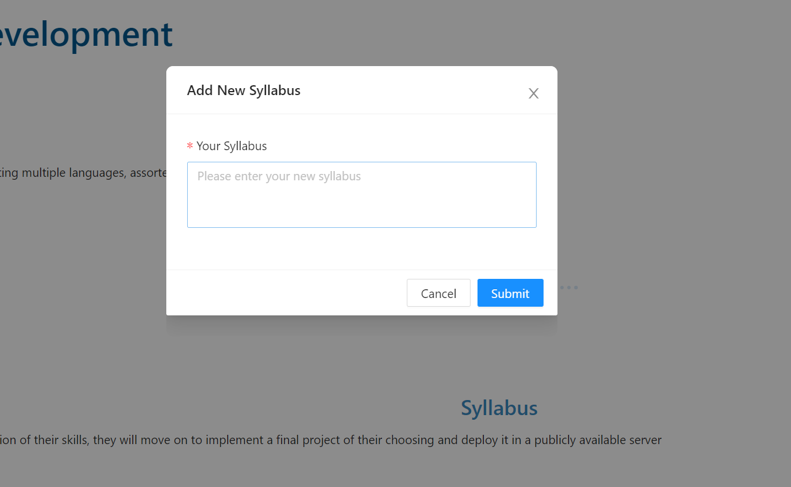
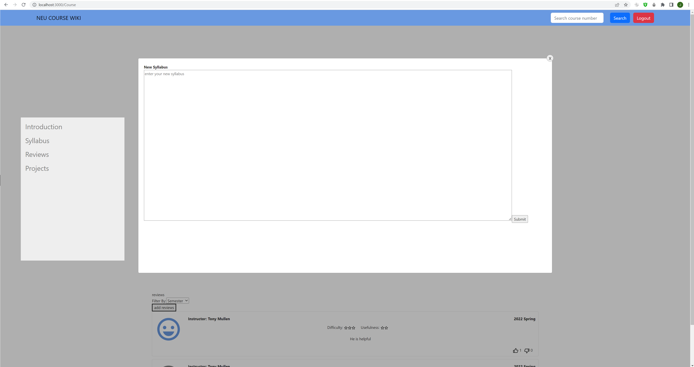

# NEU Course Wiki Frontend

Group Name: DarkHorse  
Group Members: Sixin Li, Zixin Zhao, Jiayan Ma

## Heroku Deploy  
https://coursewiki-frontend-darkhorse.herokuapp.com/

## Test Methods:  
Search Course ID in the search box on homepage or on top navigation bar.
Try: CS5610 or CS5200

## Introduction

This is the NEU course Wiki Frontend.  

## Iteration 3 

We finished all functionalities and interactions as required:  
- User interface with data by at least 2 CRUD for two database:  review database and project database.
- Three different UI routes: homepage, course page, project page.
- One Bootstrap UI component not featured in demo: InputGroup, for styling the search box on top navigation bar.
- We have different layout and design from the demo.
- We used GraphQL interface to the database. (It can be tested by running the backend)
- Additionally, we made the website look neat and nice under the mobile resolution.

## Functionality  
1. Search by course ID  
    -Links to the corresponding course page if course exists.  
    -Pop up a window to alert user that course not found.
2. Display course introduction, syllabus, reviews and projects  
    -Introduction is the same as the course introduction in official NEU course schedule. 
3. Request to upload syllabus for each course
4. Reviews:  
    -All users can see reviews while only logged in users can add reviews.   
    -When a not logged in user try to add a review, a notification pop up will remind them to login.   
    -All users can upvote and downvote a review.  
    -Users can filter reviews by semester and instructors: Semesters are written in the files.    
    -Use pagination component to see all reviews for a course.  
5. Projects:  
    -All users can see all projects.   
    -Users can filter projects by semester and instructors: Semesters are written in the files.    
    -All users can click the link to view the project.  
    -Load more button and back to the top button can help you view the projects.  

- Home Page:   
   

- Course Page: 
  
 

- Project Page:  
  

## Contribution
#### Sixin Li  
- ​      Make addReview Modal only show when user is logged in   
- ​      Fix bug - show newly added reviews real-time
- ​      Implement functionality to send updated votes to databas
- ​      Add pagination for review and expand the filter box
- ​      Add media query for reviewCard

#### Jiayan Ma  
- ​      Update search function with enter key
- ​      Update the datailed design of homepage and course page
- ​      Add pop-up window for course not found  

#### Zixin Zhao  
- ​      Add load more button in projects page 
- ​      Add return to the top in projects pageAdd return to the top in projects page
- ​      Add useSyncCallBack component to get the data from useState
- ​      Add media query for projects and projects card

## Iteration 2  

We implemented the data retrieval service, diplayed the backend data on pages and improved the user interaction.  
- Home Page:   
   

- Course Page: 
  

- Project Page:  
  

## Contribution
#### Sixin Li  
- ​      Add cascader filters for semester and instructor in displaying reviews, and get reviews by filters from database  
  

- ​      Can get reviews from database and add reviews to database
- ​      Make thumbs up and down icons 
  

#### Jiayan Ma  
- ​      Make the search boxes work on home page and navigation bar by getting course data by course_id from course database
- ​      Render home page and course page with better style design
- ​      Improve mobile friendly design  
  

- ​      Update pop-up window style of requesting edit syllabus to be consistent  
  

- ​      Update search box on top navigation bar with a new bootstrap UI component - “inputgroup”  
  

#### Zixin Zhao  
- ​      Add cascader filters for semester and instructors in displaying projects, and get projects, by filters from database  
  
- ​      Can get projects, from database and add projects, to database
- ​      Can get instructors by course_id from database

## Iteration 1 features

We've built the overall structure and implemented the React components related to the backend database.  
It contains three routes with their corresponding pages:
- Home Page:   
   

- Course Page: 
  

- Project Page:  
  

## Contribution

#### Sixin Li 

- ​      Designed cards for displaying reviews in the course page  
  
       
- ​      Used third-party library "antd" to create the modal to add review  
 

#### Jiayan Ma

- ​      Built the overall React structure
- ​      Designed the home page and navigation bar
- ​      Created the pop up window for update syllabus on course page
  

#### Zixin Zhao

- ​      Designed projects page for displaying projects in the page
- ​      Used third-party library "antd" to create the modal to add projects  
  

